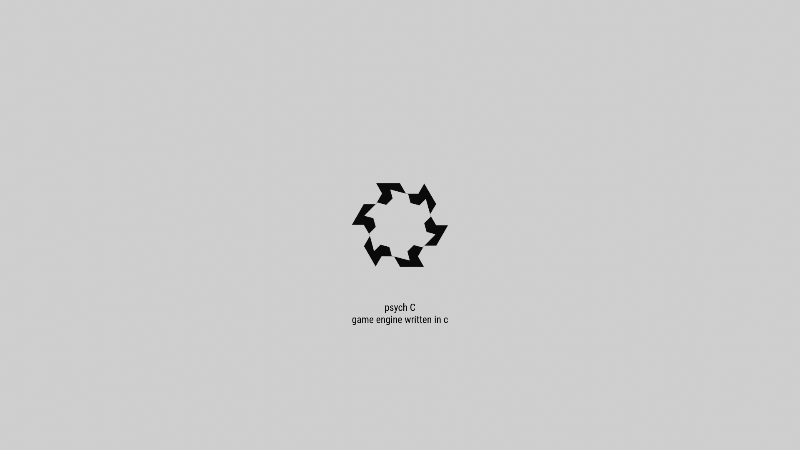

## Summary of features planned

* simple rendering ( pbr, skeletal system, opengl )
* audio rendering (openal)
* multiplayer ( client/server, peer to peer)
* physics system ( bullet )

## Motivations
- psychC strives to be a collection of well written (reusable, general, sane) functions required for making a game.
- functions should be as simple as possible, and no simpler.
- there are a lot of functions which do not fit these reqs, they are written temporarily till i figure out a good interface. these will be present in the main file most often.
- I only know opengl, opengl is the simplest of all, and is sufficient as of now, hence it is picked over vulkan
- functions should be such that they can be reused to put together a game before a game jam
- functions should run on both linux and windows ( cross-platform )

## Detailed feature plan

### Systems
- [ ] scene format, parsing exporting, blender exporting

### animations
- [x] model.play_animation()
- [x] load model with multiple animations
- [ ] morph targets for facial animation
- [ ] Animation blending
- [ ] drive animation through code
  
### input and camera
- [x] expose proper functions for camera management styles tps,fps, etc.
- [ ] a way to handle input that is exhaustive to all input styles (time held, last pressed, modifier keys)
- [ ] add collision to 3rd person camera
- [ ] controller support

### audio
- [x] load wav files and play audio
- [x] play_sound("walk.wav", transform) ( Manager )
- [x] mixing multiple audio??
- [ ] streaming audio from disk

### shading & _gaaphics_
- [ ] normal mapping
- [ ] skybox
- [ ] general purpose material system
- [ ] texture splatting
- [ ] cloth sheen
- [ ] decals
- [ ] global illumination
- [ ] bake lights for static objects via blender or in engine
- [ ] shadows ( cascade ) ( for dynamic objects )

### physics
- [ ] collision detection and callback
- [ ] ray casting and intersection
- [ ] load convex hull from disk
- [ ] use existing physics library like bullet,etc.

### netcode
- [ ] lobby system
- [ ] udp reliable and unreliable communication
- [ ] p2p implementation ( one computer will act as server) ( research needed )
- [ ] maybe using webrtc ( research needed )
- [ ] maybe voip ?

### UI (in game)
- [ ] Helper functions for 2d textured plane rendering
- [ ] play video
- [ ] text rendering ( if possible via imgui )
- [ ] imgui

### UI (dev)
- [ ] (imgui) pattern to use quickly to debug/iterate on values.

## Version history
### v0.1 ( currently being worked on )
- really basic pbr. point lighting/ fake ambient term [ ]
- scene descriptor [ ]
- skybox support [ ]
- simple animation support ( no blending ) [x]
- spatial audio [x]
- first person camera, third person camera [x]
- mouse and keyboard input support [x]
- Basic UI support [ ]
- Video playback [ ]